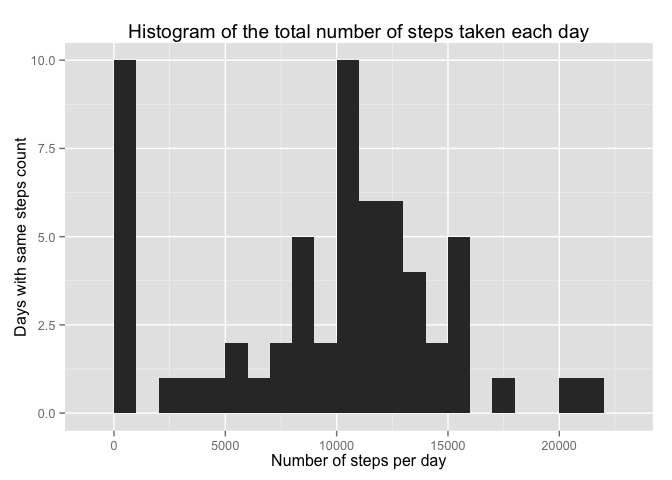
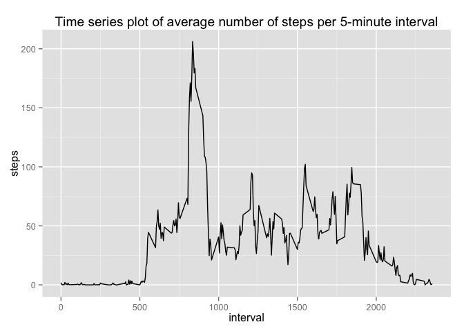

# Reproducible Research: Peer Assessment 1


## Loading and preprocessing the data

Unzip the "activity.zip" file and place the CSV "activity.csv" in working directory


```r
activityData = read.csv("activity.csv", header=TRUE)
```

There's no need for additional processing the data.

## What is mean total number of steps taken per day?

We need to aggregate the data by making a sum of number of steps per each day. We are dropping missing values from dataset


```r
stepsPerDay <- aggregate(activityData[, 'steps'], by = list(activityData$date), FUN = sum, na.rm = TRUE)
```

And we can give more descriptive names to our columns


```r
names(stepsPerDay) <- c("Interval", "Steps")
```

So now we can use stepsPerDay variable as our dataset to make histogram of the total number of steps taken each day. We are using ggplot2 for plotting system.


```r
library(ggplot2)
qplot(x = stepsPerDay$Steps, 
      data = stepsPerDay, 
      geom = "histogram", 
      binwidth=1000,
      main =  "Histogram of the total number of steps taken each day",
      xlab = "Number of steps per day",
      ylab = "Days with same steps count")
```

 

These are the mean and median total number of steps taken per day


```r
mean(stepsPerDay$Steps)
```

```
## [1] 9354.23
```

```r
median(stepsPerDay$Steps)
```

```
## [1] 10395
```

## What is the average daily activity pattern?
Now we're aggreagating the data by 5-minute intervals, and we're also dropping NA values


```r
stepsPerInterval =  aggregate(activityData[, 'steps'], by = list(activityData$interval), FUN = mean, na.rm = TRUE)
```

Again, giving columns proper names


```r
names(stepsPerInterval) <- c("Interval", "Steps")
```

And making a time series plot with ggplot2 plotting system


```r
ggplot(stepsPerInterval) + 
    aes(x = Interval, y = Steps) + 
    geom_line() + 
    labs(title = "Time series plot of average number of steps per 5-minute interval")
```

 

To answer the question which 5-minute interval, on average across all the days in the dataset, contains the maximum number of steps we get that this is the interval:


```r
stepsPerInterval[which.max(stepsPerInterval$Steps), ]$Interval
```

```
## [1] 835
```

## Imputing missing values
Total number of missing values in the initial dataset that we loaded from CSV (the total number of rows with NAs) we can get by doing:


```r
missingValues <- nrow(activityData[is.na(activityData$steps),])
```

So the total number of NA values in the dataset is ``2304``

## Are there differences in activity patterns between weekdays and weekends?
